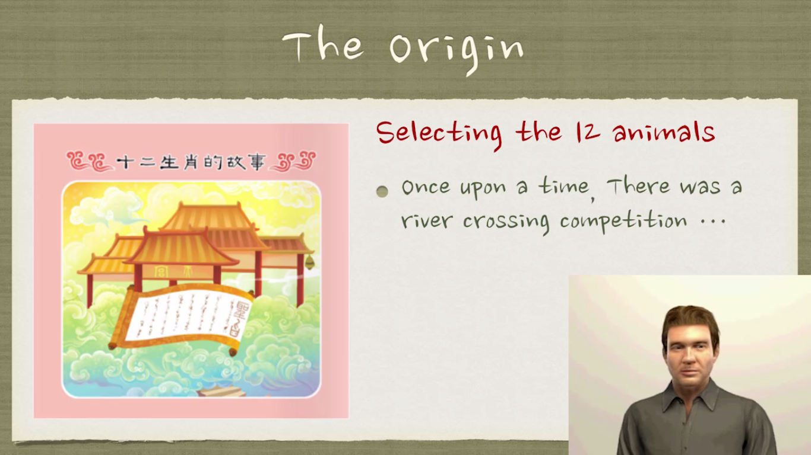
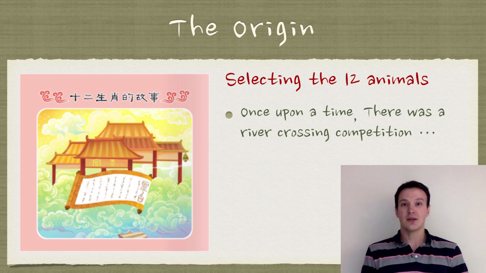
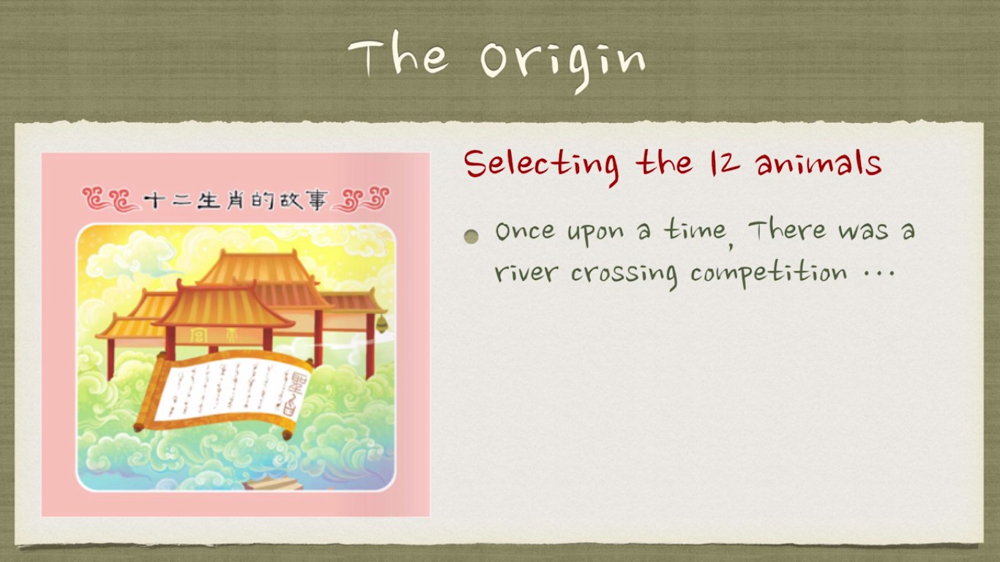

This project investigates the effect of the embodiment of a video instructor on the learning performance of the student.

See report/ folder for PDF of report.

Authors
--------------------
* Jia-Shen Boon <boon@cs.wisc.edu>
* Ke Ma <kma@cs.wisc.edu>
* Ayon Sen <ayonsn@cs.wisc.edu>

Conditions
--------------------
Links to the videos used in our experiments are given below
* [Instructor embodied by a virtual agent](http://youtu.be/MlTh3zx2WRU)
* [Instructor embodied by himself/herself](http://youtu.be/u6SBEUv1TdU)
* [Instructor with no embodiment](http://youtu.be/QQ0XuEJ7WjA)

Below we show screenshots of the virtual agent embodiment, human embodiment and no embodiment respectively.

